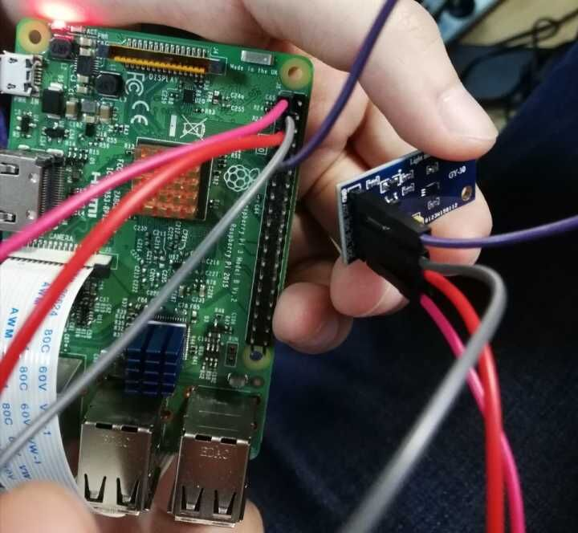

# Driver-Fatigue-Detection-on-Raspberry

A system detect fatigue of drivers using face feature on raspberry 3B or PC.

* For raspberry 3B , it also has the ability to warn the drivers according to their fatigue level (using both image and sound) . 

* Moreover , it can instruct the drivers to change their position (using sound). 

* On top of that , a light matched method using a photosensitive resistance is added.
  
  # Code structure

* [`dlib_model`](dlib_model/): containing the trained dlib model (using deep learning) to detect the key point of face.
  
  * [`shape_predictor_68_face_landmarks.dat`](dlib_model/shape_predictor_68_face_landmarks.dat):the trained dlib model (using deep learning) to detect the key point of face.

* [`for_pc/`](for_pc/): the main python file for computer to use.
  
  * [`ok_pc.py`](for_pc/ok_pc.py):the most precise detecting method containing both the yawn detector and the blink detector on computer.
  * [`pc_v1.py`](for_pc/pc_v1.py):the most simple but quick detecting method containing both the yawn detector and the blink detector.
    
    By the way ,the major difference between the two will be discussed in the next section.

* ['for_raspberry/`](for_raspberry): the main python file for raspberry3B to use.
  
  * [ras.py`](for_raspberry/ras.py): the most precise detecting method containing both the yawn detector and the blink detector on raspberry.

* [music](music/): the warn sound in Chinese.

# Requirements

## for PC users

* Code only tested on windows system (win10) and linux system (ubuntu 16.04)

* Python 2.7 (Anaconda 3.6.3 specifically) with opencv2 are recommended (maybe python3 with opencv3 is OK)

* imutils

* scipy

* numpy

* dlib

## for Raspberry users

* Code only tested on Raspberry 3B and Raspberry 3B+ with linux system (ubuntu 16.04)

* A 5 mega-pixel camera is needed and must be enabled.

* Python 2.7 with opencv2 are recommended (maybe python3 with opencv3 is OK)

* imutils

* scipy

* numpy

* dlib

* sys

* smbus

* os

* pygame

# IO define (Raspberry 3B or 3B+)

  

# To using the detector on PC
## To use
simply run 
```bash
python ras_pc.py
```
or 
```bash
python pc_v1.py
```

## In file `ok_pc.py

you may varify to match your own condition

```python
thresh_0=0.4# for yawn detector
thresh_2=0.72# for yawn detector

thresh = 0.25 # for blink detector
```

you may varify to match your own model location

```python
predict = dlib.shape_predictor('shape_predictor_68_face_landmarks.dat')
```

## The difference between  [ok_pc.py](for_pc/ok_pc.py) and  [`pc_v1.py`](for_pc/pc_v1.py)

  In file [ok_pc.py](for_pc/ok_pc.py) 

```python
class stack:# round-robin to save old month statuses

    def __init__(self,capacity):
        self.capacity=capacity
        self.memory=[]
        self.position=0
    def push(self,obj):
    ###save a transiton###
        if len(self.memory)<self.capacity:
            self.memory.append(1)
        tmp=self.position
        self.memory[self.position]=obj
        self.position=(self.position+1)%self.capacity
        return tmp
    def sample(self,batch_size):
        return random.sample(self.memory,batch_size)
    def ready(self,batch_size):
        return len(self.memory)>batch_size
    def _len_(self):
        return len(self.memory)
    def min(self,leng,con):
        a=np.array(self.memory)
        for i in range(self.capacity-1):
            if(abs(i-con)<leng or abs(con-i+self.capacity)<leng):
                a[i]=10000
        print(a)
        return a.min()
 
```
* The [ok_pc.py](for_pc/ok_pc.py) using a round-robin to save old month statuses to distinguish laugh and draw . In other words , only when you open the month in a precise range of time , it will be classified as yawn . Both too long and too short time will be classified as  fake yawn and will be ignored.

# To using the detector on Raspberry 3B and 3B+

## To use
simply run 
```bash
python ras.py
```

  In file  [`ras.py`](for_raspberry/ras.py):


you may varify to match your own condition

```python
thresh_0=0.4# for yawn detector
thresh_2=0.72# for yawn detector

thresh = 0.25 # for blink detector
```

you may varify to match your own model location

```python
predict = dlib.shape_predictor('shape_predictor_68_face_landmarks.dat')
```
  
  ## Warn method
  
   In file  [`ras.py`](for_raspberry/ras.py):


warn using sound produced by raspberry

```python

def playmusic(path):
    print("playmusic")
    pygame.mixer.init()

    pygame.mixer.music.load(path)
    pygame.mixer.music.play()
    time.sleep(3.0)
    print("playmusic")
    
```
light detector , you may change the IO number according to your own photo Photosensitive resistance
```python
def light():
    bus = smbus.SMBus(1)
    addr = 0x23
    data = bus.read_i2c_block_data(addr,0x11)
    light=(data[1]+256*data[0])/1.2
    return light 
```
